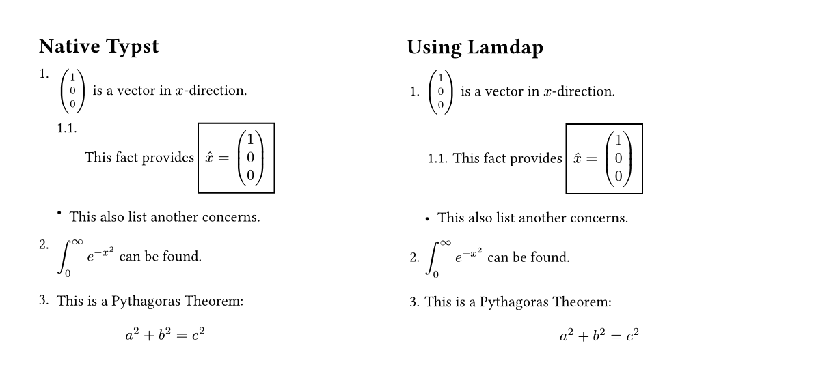
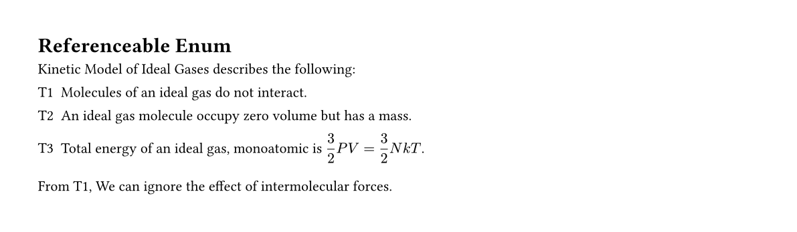

# Lamdap
An attempt to fix native Typst ordered and unordered list layout

## Usage 
```typ
#import "@preview/lamdap:0.1.0": betterenum, bettelis

#show: betterenum // for fixing enum
#show: betellis // for fixing list
// go with your flow.
```
## Comparison 


## Features 
- Fix `enum` and `list` baseline shift. 
- Provide a referencable `enum` by the following syntax: 

```typ
= Referenceable Enum 
#show: betterenum

Kinetic Model of Ideal Gases describes the following: 
#set enum(numbering: "T1")
#enum.item[Molecules of an ideal gas do not interact.]<interact>
+ An ideal gas molecule occupy zero volume but has a mass.
+ Total energy of an ideal gas, monoatomic is $display(3/2 P V = 3/2 N k T)$.
From @interact, We can ignore the effect of intermolecular forces.
```



